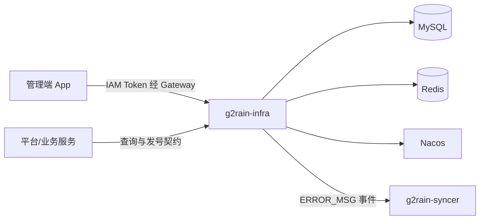

# 架构总览

本项目按 g2rain [`java-domain-service 1.0.0`](https://github.com/g2rain/g2rain/tree/architecture-v1.0.0/docs/architecture/profiles/java-domain-service) 进行接入准备。本页描述 Infra 的领域落地；未完成事项见[架构差异](deviations.md)。

## 系统职责

`g2rain-infra` 是平台公共元数据和分布式 ID 的权威服务，负责字典、Locale、国际化消息、Snowflake Worker 租约和业务号段。

## 核心领域

| 领域 | 代表对象 | 职责 |
| --- | --- | --- |
| 字典 | `DictionaryUsage`、`DictionaryItem` | 管理用途、层级明细和本地化选项。 |
| 地域语言 | `LocaleSetting` | 校验并维护 language-region 编码及显示名称。 |
| 国际化 | `I18nMessage`、`I18nMsgUsage` | 管理 UI 文案和错误消息，并广播错误消息缓存变化。 |
| 分布式 ID | `Keysmith`、`SnowflakeKeysmith` | 使用 Redis Worker 租约生成 Snowflake ID。 |
| 业务号段 | `G2rainRaindrop`、`SegmentKeysmith` | 使用 MySQL 号段、双缓冲和动态步长分配业务 ID。 |

## 非职责

- 不维护 Gateway 动态路由；`route_definition` 只是代码生成配置中的残留表名。
- 不负责认证、Token 或 Session。
- 不承载具体业务数据和前端页面。
- 不执行生产数据库迁移或部署编排。
